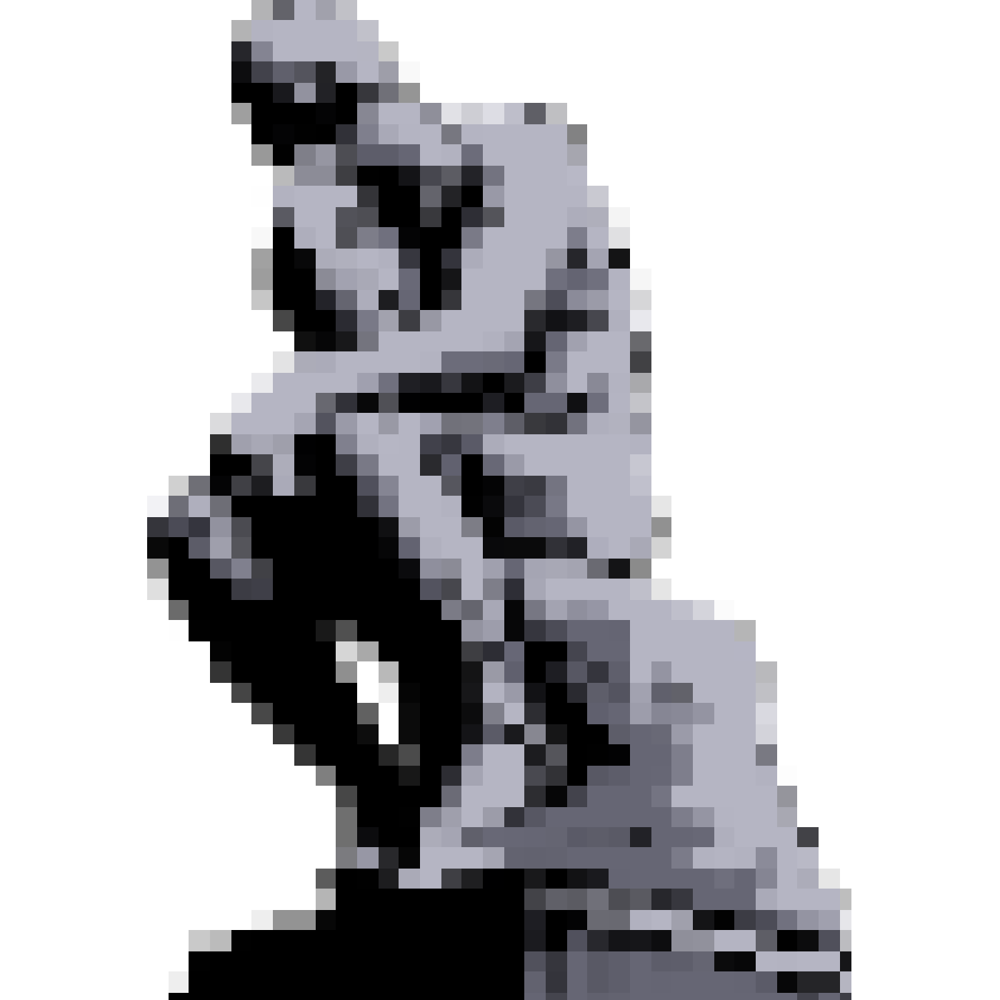
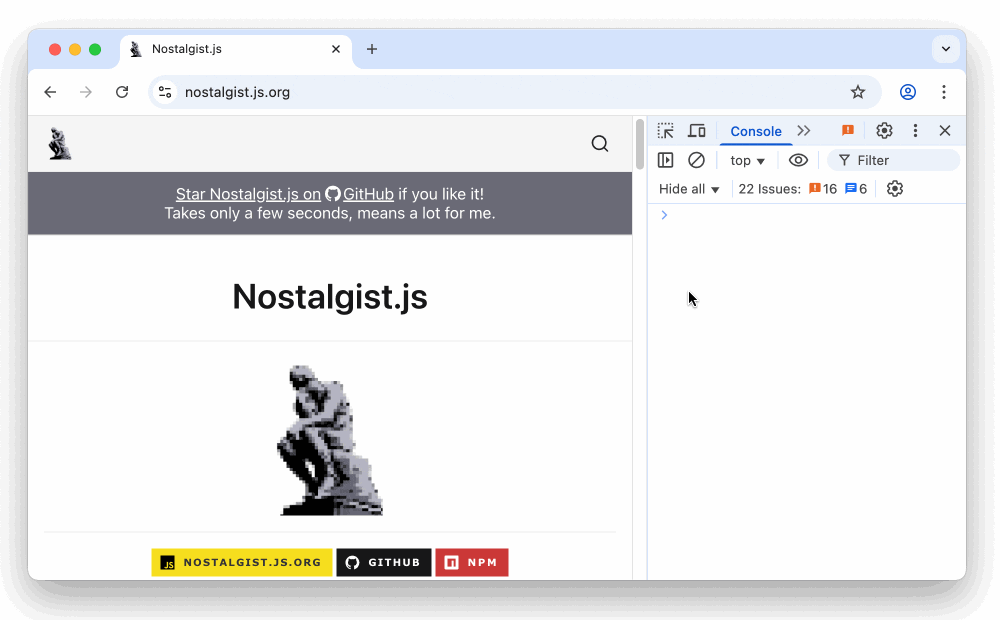

<h1 align="center">Nostalgist.js</h1>

<p align="center">
  
</p>

<p align="center">
  <a href="https://nostalgist.js.org/" title="nostalgist.js.org">
    
  </a>
  <a href="https://github.com/arianrhodsandlot/nostalgist" title="Nostalgist.js on GitHub">
    
  </a>
  <a href="https://www.npmjs.com/package/nostalgist" title="Nostalgist.js on NPM">
    
  </a>
</p>

Nostalgist.js is a JavaScript library that allows you to run emulators of retro consoles, like NES and Sega Genesis, within web browsers.

>  [!tip]
>  Nostalgist.js is for developers. If you are a player rather than a developer planning to build something, you may want to try another open-source project [RetroAssembly](https://github.com/arianrhodsandlot/retro-assembly).

## A Quick Glance
<p align="center">
  
</p>

## Website
Checkout [nostalgist.js.org](https://nostalgist.js.org/) for more online examples and documentation.

## Features
+ Launch a retro game with RetroArch emulator in a browser

  ```js
  import { Nostalgist } from 'nostalgist'

  await Nostalgist.launch({
    core: 'fceumm',
    rom: 'flappybird.nes',
  })
  ```

  Related API: [`launch`](https://nostalgist.js.org/apis/launch)
+ Save the state of the game, then load it later

  ```js
  import { Nostalgist } from 'nostalgist'

  const nostalgist = await Nostalgist.nes('flappybird.nes')
  const { state } = await nostalgist.saveState()
  await nostalgist.loadState(state)
  ```

  Related APIs: [`saveState`](https://nostalgist.js.org/apis/save-state), [`loadState`](https://nostalgist.js.org/apis/load-state)
+ Customize any RetroArch config before launching
  ```js
  import { Nostalgist } from 'nostalgist'

  const nostalgist = await Nostalgist.launch({
    core: 'fceumm',
    retroarchConfig: {
      rewind_enable: true,
    },
    retroarchCoreConfig: {
      fceumm_turbo_enable: 'Both',
    },
    rom: 'flappybird.nes',
  })
  ```

  Related API: [`launch#retroarchConfig`](https://nostalgist.js.org/apis/launch#retroarchconfig)
+ Access low level APIs of Emscripten

  ```js
  import { Nostalgist } from 'nostalgist'

  const rom = 'https://example.com/zelda.sfc'
  const nostalgist = await Nostalgist.snes(rom)
  const FS = nostalgist.getEmscriptenFS()
  FS.readdir('/')
  ```

  Related APIs: [`getEmscriptenModule`](https://nostalgist.js.org/apis/get-emscripten-module), [`getEmscriptenFS`](https://nostalgist.js.org/apis/get-emscripten-fs)

## Motivation
Nostalgist.js is built on top of RetroArch Emscripten builds. We love RetroArch to run in browsers because that's portable and convenient. Although there is already an official instance, [RetroArch web player](https://web.libretro.com/), and some third-party ones like [webretro](https://binbashbanana.github.io/webretro/), it's still not that easy to launch RetroArch in a browser programmatically.

The purpose of Nostalgist.js is to simplify the process of launching an emulator to play a game, via RetroArch, in browsers. Given a ROM and a core, the game should be launched without any additional configuration.

## APIs
Please refer to [nostalgist.js.org/apis](https://nostalgist.js.org/apis).

## Related
### Showcases

> [!note]
> Feel free to add yours by sending a pull request.

+ [RetroAssembly](https://github.com/arianrhodsandlot/retroassembly)

  A personal retro game collection cabinet in your browser.

+ [vme](https://github.com/gitGalu/vme)

  Virtual Machine / Emulator - multi emulator web app

+ [ultimate-homebrew-extensions](https://github.com/longjoel/ultimate-homebrew-extensions)

  Runs an emulator to test ROMs inside of VS Code

+ [NextCloud Nostalgist](https://github.com/RobLoach/nextcloud-nostalgist)

  Run emulators of retro consoles directly in NextCloud via Nostalgist.js.

+ [Nostalbit](https://github.com/iDarkSSJ/Nostalbit)

  A retro web emulator with Next.js, Tailwind, TypeScript

+ [AstroEmu](https://github.com/syed-sakeeb-ahmed/AstroEmu)

  Famicom and Super Famicom on the web

### Credits

+ These are the fundamental dependencies of Nostalgist.js.
  + [RetroArch](https://www.retroarch.com/) and its friends(the emulators/cores)
  + [Emscripten](https://emscripten.org/)

+ We are using ROMs here for the purpose of demonstration.
  + [retrobrews](https://retrobrews.github.io/) and the authors of the homebrew games.

+ By default, our ROMs and cores are all loaded from this free CDN service.
  + [jsDelivr](https://www.jsdelivr.com/)

### Alternatives
+ [EmulatorJS](https://emulatorjs.org/)

  Another JavaScript library for emulation inside browsers.

  It's more powerful and more sophisticated. It includes many custom cores and has a friendly user interface. It can be used inside mobile browsers with touch support.

  It's not that friendly towards modern frontend development.


## Caveat
> [!caution]
> + Nostalgist.js **DOES NOT** provide any pirated content, like copyrighted ROM files or BIOS files.
> + And it **DOES NOT** encourage that.

## License
[MIT](license)
